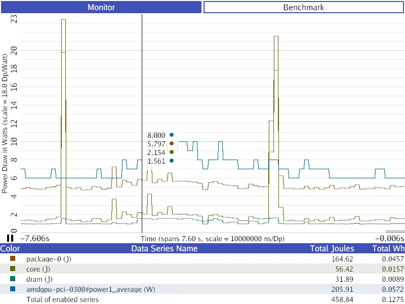
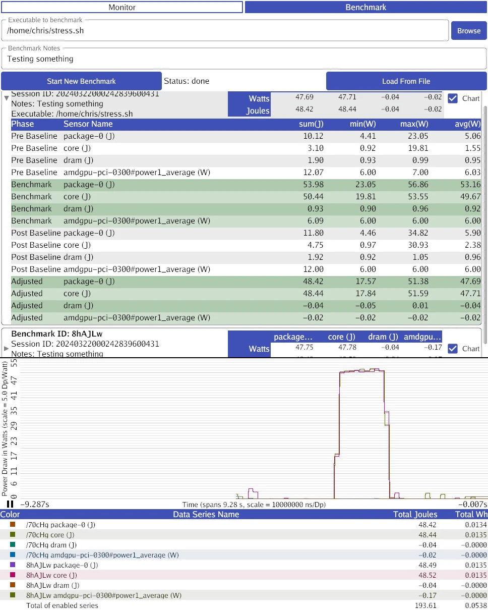

# Watt Wiser

A software energy consumption estimation tool built as part of the [Watt-Wise Game Jam](https://wattwise.games/).


## Status

Usable for simple energy estimation and benchmarking. The GUI is functional on Linux, macOS, and Windows, and the sensors support is captured in the following table.

| OS | Intel CPU | AMD CPU | Apple CPU | NVIDIA GPU | AMD GPU |
| --- | --- | --- | --- | --- | --- |
| Linux | ✅ (RAPL) | ✅ (RAPL) | N/A | ✅ (NVML) | ✅ (HWMON) |
| Windows | ✅ (RAPL) | ⚠* (RAPL) ️| N/A | ✅ (NVML) | ✅ (ADLX) |
| macOS | ❌| N/A | ❌ | ❌ | ❌|

> *AMD CPUs on Windows are supported by the Scaphandre driver we use to read CPUs, but a bug prevents us from reading them in the released Scaphandre driver. [This PR](https://github.com/hubblo-org/windows-rapl-driver/pull/9) fixes it.

Interested users on platforms without sensor support can still try the GUI out on the included example trace file.

To be clear, we'd like to check every box we can, but it can be difficult to figure out how to access relevant sensors on various platforms. If you think you can help us figure out a missing platform, please reach out!

## Installing Watt Wiser

How to install Watt Wiser on supported platforms. macOS is not listed because we do not yet have sensors working there, but we intend to add support.

### Linux Binary Release

- Install `xdg-desktop-portal` and at least one implementation of it (such as `xdg-desktop-portal-gnome` or `xdg-desktop-portal-kde`) in order to open trace files with a file picker.
- Find the latest Watt Wiser release [here](https://github.com/wattwisegames/watt-wiser/releases) and download the tarball file for linux (should end with `linux.tar.xz`).
- Extract the tarball somewhere.
- Run `sudo ./watt-wiser-sensors | ./watt-wiser -` to visualize the your system. Superuser permissions are required to read the RAPL energy sensors on Linux, as they can be used as a cryptographic side channel.

### Linux Packages

- Arch Linux (AUR)
  - [`watt-wiser-sensors-git`](https://aur.archlinux.org/packages/watt-wiser-sensors-git) for collecting statistics
  - [`watt-wiser-git`](https://aur.archlinux.org/packages/watt-wiser-git) for graphing statistics collected with `watt-wiser-sensors`, depends on `watt-wiser-sensors`

- Install `xdg-desktop-portal` and at least one implementation of it (such as `xdg-desktop-portal-gnome` or `xdg-desktop-portal-kde`) in order to open trace files with a file picker.
- Run `sudo ./watt-wiser-sensors | ./watt-wiser -` to visualize the your system. Superuser permissions are required to read the RAPL energy sensors on Linux, as they can be used as a cryptographic side channel.

### Windows

- To read *any* data from an Intel or AMD CPU, you need to install [Scaphandre](https://hubblo-org.github.io/scaphandre-documentation/tutorials/installation-windows.html) in order to get their Windows RAPL driver. Without this driver, Windows does not offer any way to read the hardware energy sensors.
  - If you have installation errors with the Scaphandre installer, make sure you have [the Microsoft C++ Redistributable](https://learn.microsoft.com/en-us/cpp/windows/latest-supported-vc-redist?view=msvc-170#visual-studio-2015-2017-2019-and-2022).
  - **NOTE**: Until [this PR](https://github.com/hubblo-org/windows-rapl-driver/pull/9) is merged and included in a Scaphandre release, AMD CPU data cannot be read without building a custom windows kernel driver.
- Find the latest Watt Wiser release [here](https://github.com/wattwisegames/watt-wiser/releases) and download the zip file for windows (should end with `windows.zip`).
- Extract the zip somewhere.
- Run `watt-wiser.exe` and click "Launch Sensors" to gather data from supported hardware.

## GUI Controls

There are two GUI tabs, one for system energy monitoring, and the other for energy benchmarking.

### Monitor Tab



You can toggle between a line plot and a stacked area plot by clicking in the chart area. The line plot is useful for comparing the absolute values of different data sources, while the stacked area graph helps estimate total consumption.

You can also toggle on/off individual data sets by clicking on the colored square to the left of that data in the legend. When using the stacked area graph, it's important to toggle off data sets that overlap. See the next section for an example.

Scroll vertically to zoom on the time axis and horizontally to pan.

You can pause the visualzation (if showing live data) with the pause button at the origin of the chart.

### Benchmark Tab



This tab allows you to record energy benchmarks of running programs and to review prior benchmarks.

To record a new benchmark (this requires you to have the sensors running):

- [Recommended] Close all programs that you can on your computer other than watt-wiser to ensure a clean measurement.
- [Recommended] Lock your CPU and GPU clock speeds. (more docs on this soon)
- Select an executable with the "Browse" button. This should be your application or a wrapper script that runs your application with additional arguments/environment modification. **IMPORTANT**: The benchmark will last from when this program starts to when it exits. If your executable doesn't stop running, the benchmark will never complete.
- [Optional] Type any notes about what specifically you're measuring in the notes section.
- Click "Start New Benchmark" and wait. There will be a two second pause as watt-wiser gathers system baseline energy data, then your program will launch. After your program exits, there will be another two-second pause to gather a second system energy baseline.
- A summary of the benchmark will appear below the form. You can click on it to expand it into a data table with more detailed information, and you can click the "chart" checkbox to display a chart of the energy use during that baseline.

To compare benchmarks you can toggle the "chart" checkbox next to multiple runs, and they will be shown together in the chart.

You can load benchmarks from past invocations of watt-wiser with the "Load from File" button. These can also be displayed in the chart.

> Known issue: benchmarks loaded from files do not display their summary data, but do correctly show in the chart. This will be fixed soon.

#### How to read benchmark chart

This chart will show different numbers than the monitor tab because the system's baseline energy consumption is *automatically* subtracted out from the data shown. The graph is intended to reflect **only** the energy consumption of your measured application.

## Included Example Trace

This repo includes `./example-trace.csv`, a sensor recording from Chris Waldon's desktop. It has an Intel CPU and an AMD GPU, and (at the time of the recording) there were four relevant sensors supported:

- `package-0`: this data is the *sum* of all energy use reported for the CPU, DRAM, and other silicon instrumented by Intel. This data comes from Intel's RAPL technology.
- `core`: this data represents *just* the CPU, but is included within `package-0`'s total.
- `dram`: this data represents *just* the DRAM, but is included within `package-0`'s total.
- `amdgpu`: this data represents the average power draw reported by the AMD GPU via HWMON.

When viewing the data in stacked area mode, `core` and `dram` should be toggled off to get an accurate picture of the measured energy use, otherwise their usage will be counted multiple times in the graph (since they are part of `package-0`).

## Modifying Watt Wiser

These instructions provide info on how to build Watt Wiser from source if you want to modify it. Make sure you install any runtime dependencies mentioned in the installation instructions above before trying this.

### Linux Setup

You'll need:

- `git`
- the latest version of [Go](https://golang.org/dl)
- the [dependencies for Gio](https://gioui.org/doc/install), the GUI toolkit in use.
- `libsensors`'s header files, which may be packaged as part of `lm-sensors`

After installing dependences, do the following:

First, you'll need to clone the repo:

```
git clone https://github.com/wattwisegames/watt-wiser
```

OR from the other source:

```
git clone https://git.sr.ht/~whereswaldon/watt-wiser
```

Enter the project directory:

```
cd watt-wiser
```

You can then build the gui with:

```
go build .
```

Build the sensors with:

```
go build ./cmd/watt-wiser-sensors/
```

To see whether your hardware sensors have support, run the sensors program (running as root is required for RAPL energy data):

```
sudo ./watt-wiser-sensors -output trace.csv
```

Take a peek inside of `trace.csv` with any text editor.
If the CSV data it generates has more than two columns (the first two columns are just timestamps), you have some supported sensors. If you don't have any, use the provided `./example-trace.csv` from here on out.

To run the GUI against a trace, you can run:

```
./watt-wiser ./trace.csv
```

You can also directly pipe sensor data to the GUI:

```
sudo ./watt-wiser-sensors | ./watt-wiser -
```

## Windows Setup

You'll need the latest version of [Go](https://golang.org/dl) and an installation of [`git`](https://git-scm.com/download/win).

You'll also need [MingW-w64](https://www.mingw-w64.org/), which can be installed via [MSYS2](https://www.msys2.org/).

After Go is installed, do the following:

First, you'll need to clone the repo:

```
git clone https://github.com/wattwisegames/watt-wiser
```

OR from the other source:

```
git clone https://git.sr.ht/~whereswaldon/watt-wiser
```

Enter the project directory:

```
cd watt-wiser
```

You can then build the gui with:

```
go build .
```

Build the sensors with:

```
go build ./cmd/watt-wiser-sensors/
```

To see whether your hardware sensors have support, run the sensors program:

```
./watt-wiser-sensors.exe -output trace.csv
```

Take a peek inside of `trace.csv` with notepad or any other tool.
If the CSV data it generates has more than two columns (the first two columns are just timestamps), you have some supported sensors. If you don't have any, use the provided `./example-trace.csv` from here on out.

To run the GUI against a trace, you can run:

```
./watt-wiser.exe ./trace.csv
```

If you want to view your data live, make sure you have both `watt-wiser.exe` and `watt-wiser-sensors.exe` *in the same folder.*

Then simply run `./watt-wiser.exe` and select "Launch Sensors".

## Non-code Contributors

Watt Wise thanks the following people for testing hardware support and offering access to various OS/hardware configurations for debugging. Please add yourself here if you're missing.

- Ameer Ghani: Testing on numerous Linux/Windows systems.
- Gurney Buchanon: Access to a Windows+AMD CPU system and testing on numerous devices.
- Jack Mordaunt: Testing on AMD CPUs and NVIDIA GPUs.
- Josh Whetton: Access to a Linux+NVIDIA GPU system.
- Daniel Wilkins: Testing on Linux+Intel CPUs.
- Dominik Honnef: Testing on Linux+AMD CPU/GPU systems.

## License

UNLICENSE
